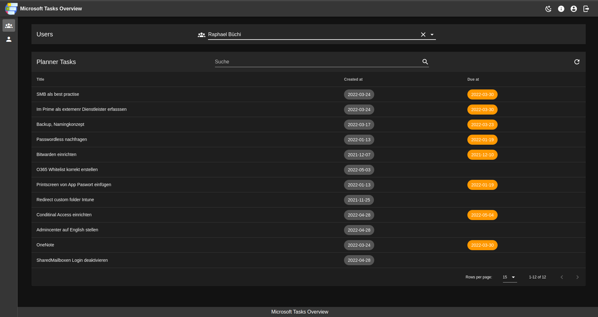

# Microsoft Taask Overview App

## About

We need a solution to view and manage Microsoft Planner tasks assigned to a user across all projects/plans.

Since Microsoft does not provide such a feature and there seems to be a lot of other people looking for something
simmilar, I wanted to write a simple Vue.js App which communicates directly with the Microsoft Graph API to solve our
problem.

Microsoft Tech
Community: <https://techcommunity.microsoft.com/t5/planner/way-to-see-all-planner-tasks-assigned-to-a-team-member/m-p/2108432#M4193>

## Problem

Since the App uses Azure AD Single-Sign-On to get access to Graphi API, it is by design not possible to receive Planner
Tasks from another person...

```json
{
  "error": {
    "code": "",
    "message": "You do not have the required permissions to access this item.",
    "innerError": {
      "date": "2022-05-07T11:31:41",
      "request-id": "...",
      "client-request-id": "..."
    }
  }
}
```

To get around this limitation you have to use `Application Permissions`
I will now write a backend service for the vue.js app to retrieve the Planner tasks over a resource api server
using `Application Permissions`.

## Installation

You can just run the docker-compose.yml file. I recommend deploying it behind a reverse proxy.

I will soon create a step-by-step guide on how to create the Azure AD App Registration and how to deploy the
containerized app behind a reverse proxy.

## What I've built so far

### List Tasks





### About


### Profile

